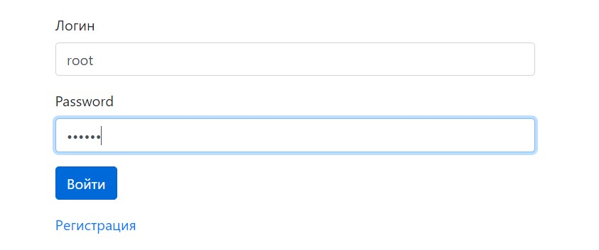
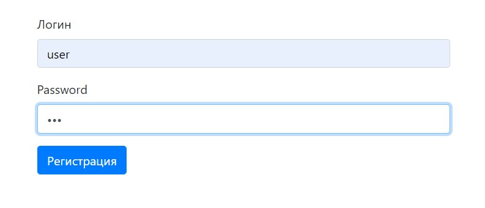
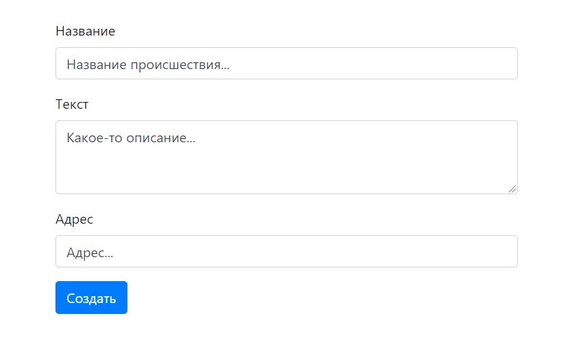
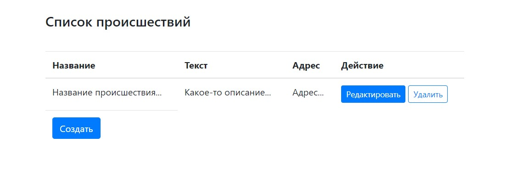

###Демонстрация работы CRUD операций с б.д.. Авторизация пользователя.
####Создание sql таблиц.
```postgresql
CREATE TABLE public.accident
(
    id serial primary key ,
    name character varying(2000) COLLATE pg_catalog."default",
    text character varying(2000) COLLATE pg_catalog."default",
    address character varying(2000) COLLATE pg_catalog."default"
)

CREATE TABLE authorities (
  id serial primary key,
  authority VARCHAR(50) NOT NULL unique
);

CREATE TABLE users (
  id serial primary key,
  username VARCHAR(50) NOT NULL unique,
  password VARCHAR(100) NOT NULL,
  enabled boolean default true,
  authority_id int not null references authorities(id)
);

insert into authorities (authority) values ('ROLE_USER');
insert into authorities (authority) values ('ROLE_ADMIN');

insert into users (username, password, authority_id)
values ('root', '$2a$10$6fJW97MOww0N4RpXYUDtEOSN4TXOTHiwh2JVvhSbLFkJ0qLSiFCMi',
(select id from authorities where authority = 'ROLE_ADMIN'));
```
Авторизация.\
Имя пользователя  с правами администратора  **root**, пароль **123456**


Страница регистрации.\


Создание инцидента.\


Созданный инцидент появляется на главной странице.
Созданные записи можно редактировать и удалять.
Удалять могут пользователи с ролью Admin
